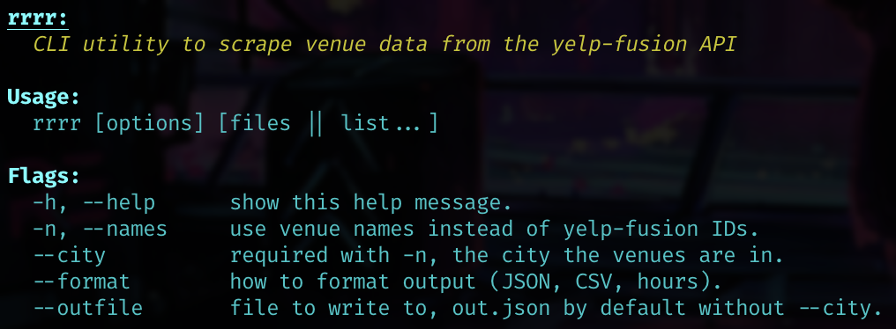

# Venue Info Scraper

The name is pretty self-explanatory, leverages the `yelp-fusion` API to get information on given venues.



## Installation

### NPM

```shell
npm install -g scrapethenslide
```

At which point `rrrr` will (hopefully) be available.

### Source
```shell
git clone https://github.com/iCalculated/venueScraper.git
cd venueScraper
npm install
```

Create a `.env` file in the directory with

```
YELP_API_KEY=<key>
```

To get a key, follow the steps [here](https://www.yelp.com/developers/documentation/v3/authentication).

## Usage

```shell
rrrr [options] [files || list...]
```

**Flags:**

```
Flags:
  -h, --help      show this help message.
  -n, --names     use venue names instead of yelp-fusion IDs.
  --city          required with -n, the city the venues are in.
  --format        how to format output (JSON, CSV, hours).
  --outfile       file to write to, out.json by default without --city.
```
### Examples:

```
rrrr infile
```

Given an `infile` of `yelp-id`s, will return JSON output matching the `Venue` schema.

```
rrrr --names --city "New Orleans, LA" --format hours infile
```

Given an `infile` of venue names in New Orleans, will return JSON output providing only `yelp-id` identifier and opening hours.

### Yelp API

The Yelp API imposes some [limitations on usage](https://www.yelp.com/developers/documentation/v3/rate_limiting). The scraper performs requests sequentially to avoid triggering the [QPS limit](https://www.yelp.com/developers/documentation/v3/qps_rate_limiting) and will likely not be impacted by the 5000 requests/day limit assuming moderate use.

## Trivia

I came up with the invocation `rrrr` at 200.